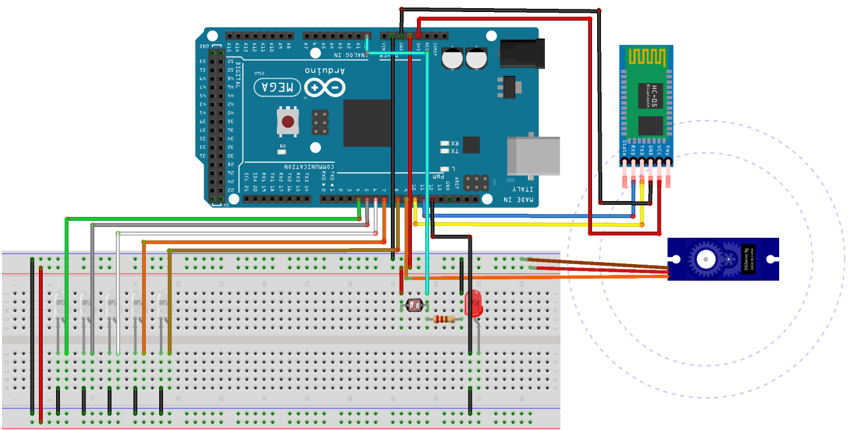
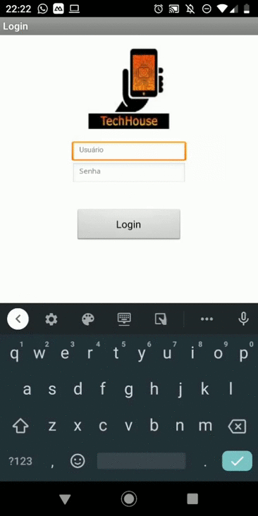

# Trabalho de Conclusão de Curso

## Tema:
* Automação Residencial.

## Qual o objetivo do projeto?
* Controlar através de um aplicativo mobile feito utilizando o App Invertor componentes do Arduino, por exemplo, controlar um Servo Motor e LED's.
* Utilizar um Módulo Sensor de Luminosidade Luz LDR para controlar LED's ao anoitecer ou amanhecer.

## Quais componentes foram utililizados no projeto?
* Módulo Sensor de Luminosidade Luz LDR;
* LED Alto Brilho 5mm Branco;
* Módulo Bluetooth HC-06;
* Micro Servo Motor;
* Arduino Mega;
* Resistores;
* Jumpers.

## Como funciona?
* Módulo Bluetooth => Conecta o aplicativo mobile ao Arduino.
* Micro Servo Motor => Simula o abrir e fechar de um portão e/ou porta.
* LED's => Simula as lâmpadas de uma casa.
* Sensor de Luminosidade => Responsável por controlar os LED's de acordo com a luminosidade do ambiente:

## Circuito Arduino:
- **Observação**: O Módulo Bluetooth da imagem é um HC-05 no projeto original foi utilizado um HC-06

## Aplicativo Mobile:

## Link's utilizados para estudo:
* [Brincando com Ideias - App Invetor](https://www.youtube.com/watch?v=TKPXS7V1YLo&list=PL7CjOZ3q8fMetW0U_kZWjYlU9bIfeHlkn&index=1)
* [Brincando com Ideias - Módulo Bluetooth HC-06](https://www.youtube.com/watch?v=Zl3IvfNaafA)
* [Felipeflop - Biblioteca Sensor Ultrassônico](https://github.com/filipeflop/Ultrasonic)
* [Felipeflop - Sensor Ultrassônico](https://www.filipeflop.com/blog/sensor-ultrassonico-hc-sr04-ao-arduino/)
* [Mert Arduino - Módulo Bluetooth e Servo Motor](https://www.youtube.com/watch?v=gL7b8E_5aYs)
